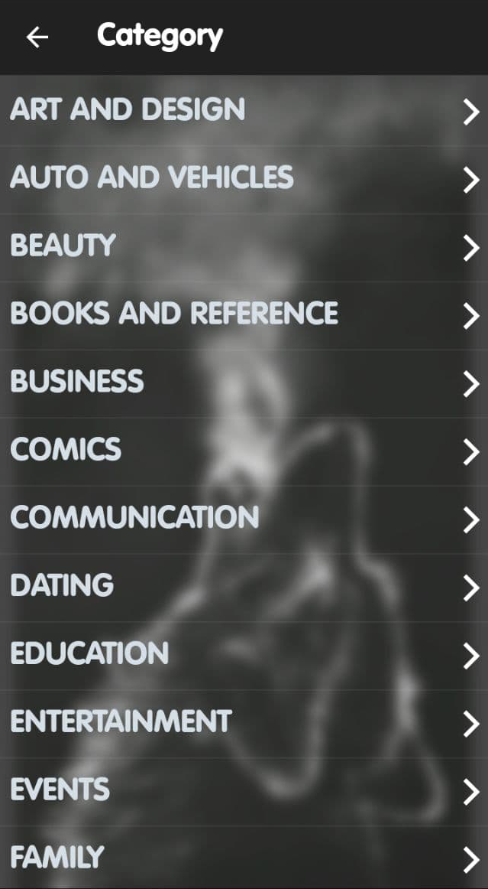

# apps info

A neat, nice looking Flutter app to visualize a dataset ! It can be built for iOS and Android .

## Screenshots

    

## Building

To build and run the app on your device, do the following:

-   [Install Flutter](https://flutter.dev/docs/get-started/install/) by following the instructions on their website.
-   Fork/clone this repo to your local machine using `git clone https://github.com/urmilshroff/goalkeeper.git`.
-   Connect your devices/emulators and run the app using `flutter run --release` in the root of the project directory.

Note: you can also run it faster in debug mode using `flutter run`, but the animations will be choppy and performance won't be as expected.

## Contributing

Found any bugs? Have any suggestions or code improvements? [Submit an issue](https://github.com/urmilshroff/goalkeeper/issues) or fork and send a [pull request](https://github.com/urmilshroff/goalkeeper/pulls) with your changes. All contributions are more than welcome, and will be merged into `flutter` (the default branch) if satisfactory.

## License

This project is licensed under the GPL License .